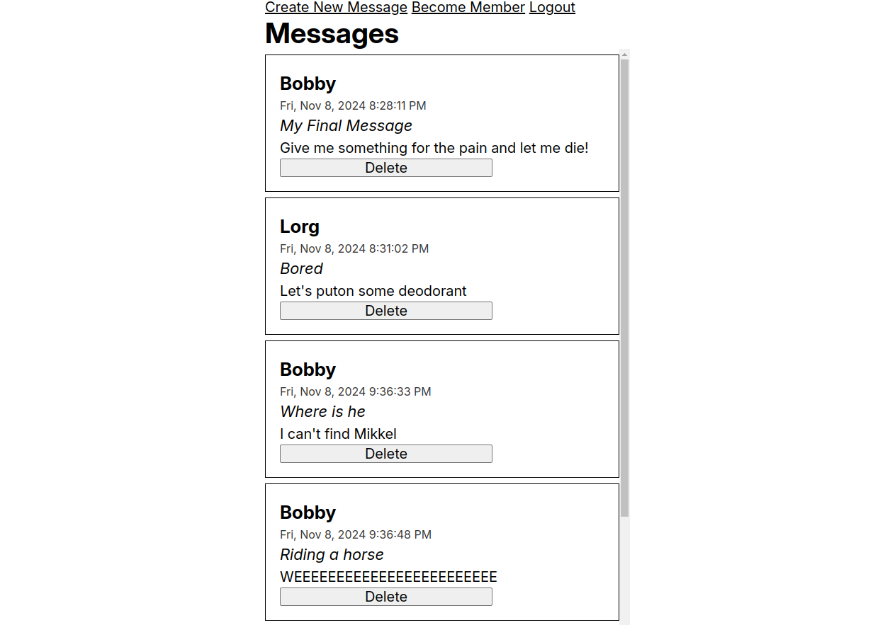

# members-only

>  [Live Website](https://members-only-production-07ba.up.railway.app/)

## Preview



## Tools/Languages

[](#)  [](#)  [](#)

[](#)  [](#) [](#)
[](#)

## Getting Started
- Create a `.env` file with all variables

```
$ git clone git@github.com:immacheetah/members-only.git
$ cd members-only
$ npm install
$ npm run start

```

## Learning Outcomes

- Use passport to create session
- Use cookie to store user session id
- Use strategies (passport-local) to authenticate users 
- Hash and salt passwords for safe storage
- Allow users to become members to access more information
- Prevent users from seeing pages they're unauthorized for
